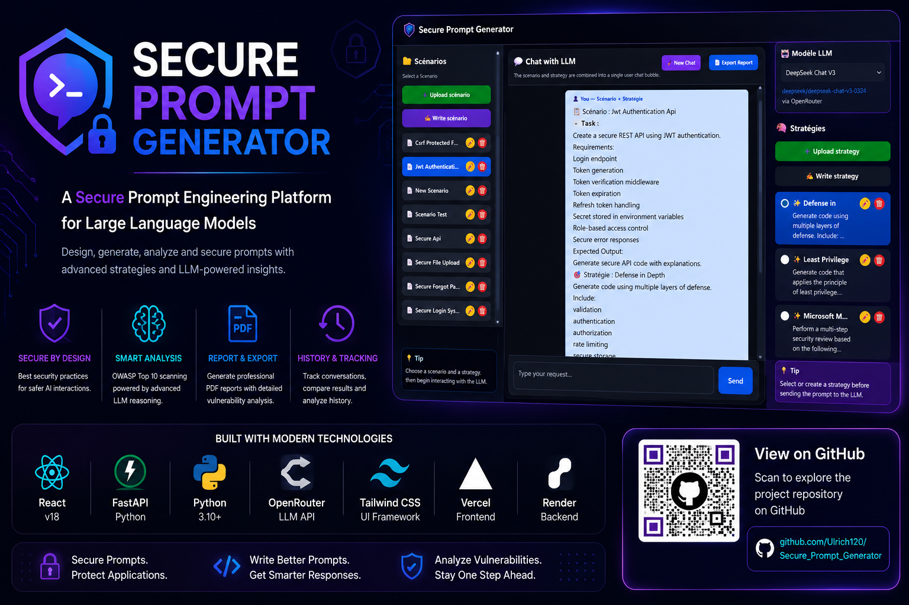
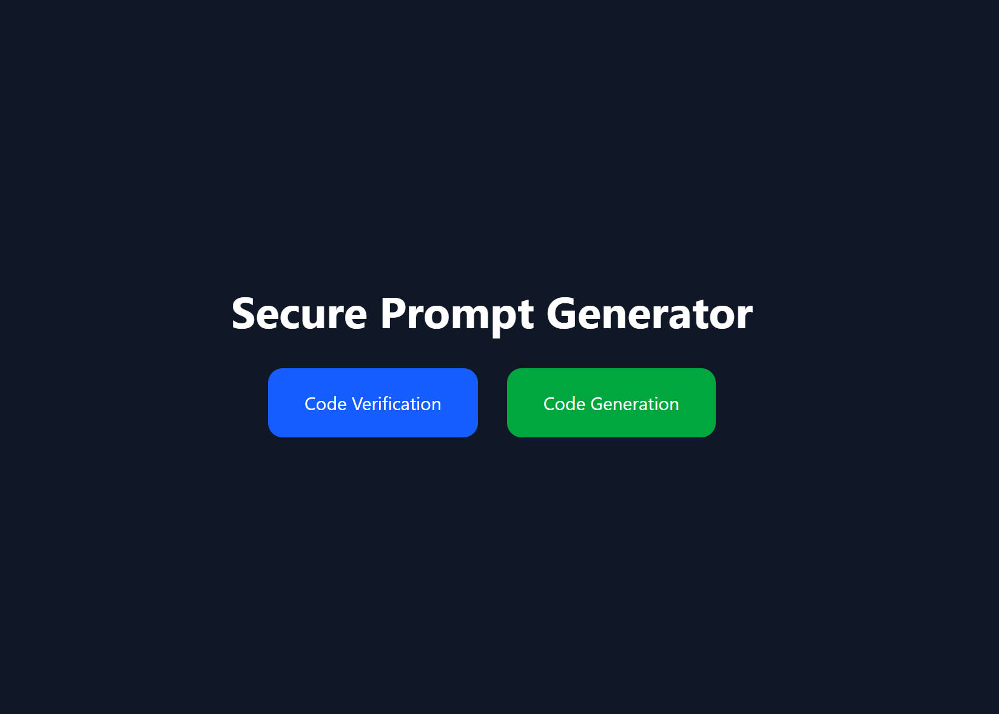
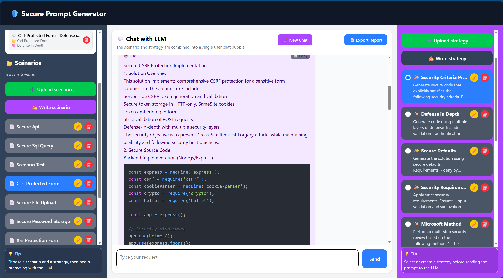
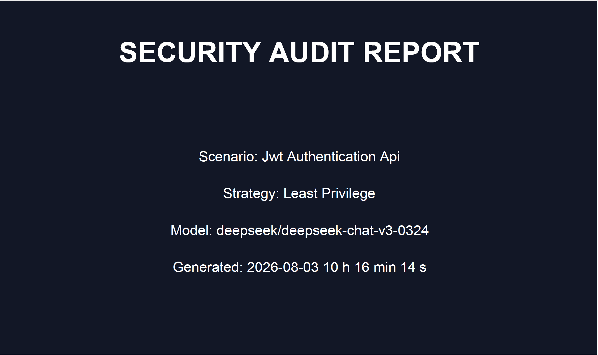
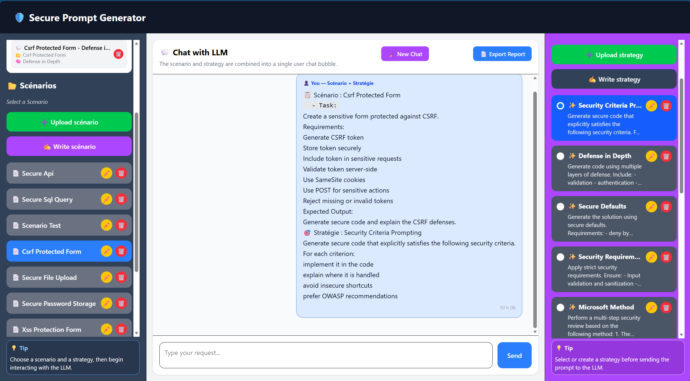
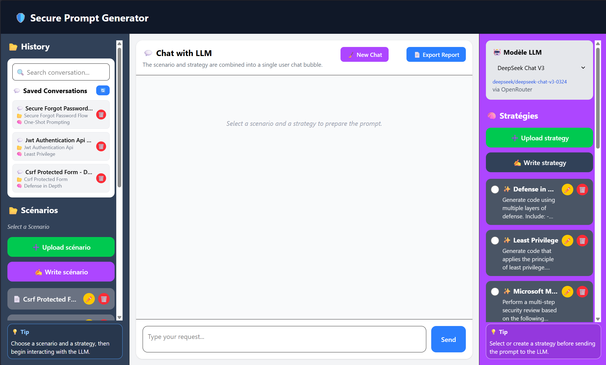
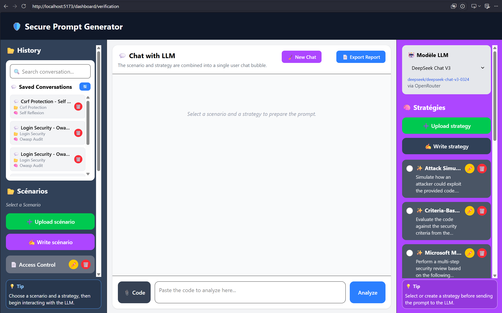
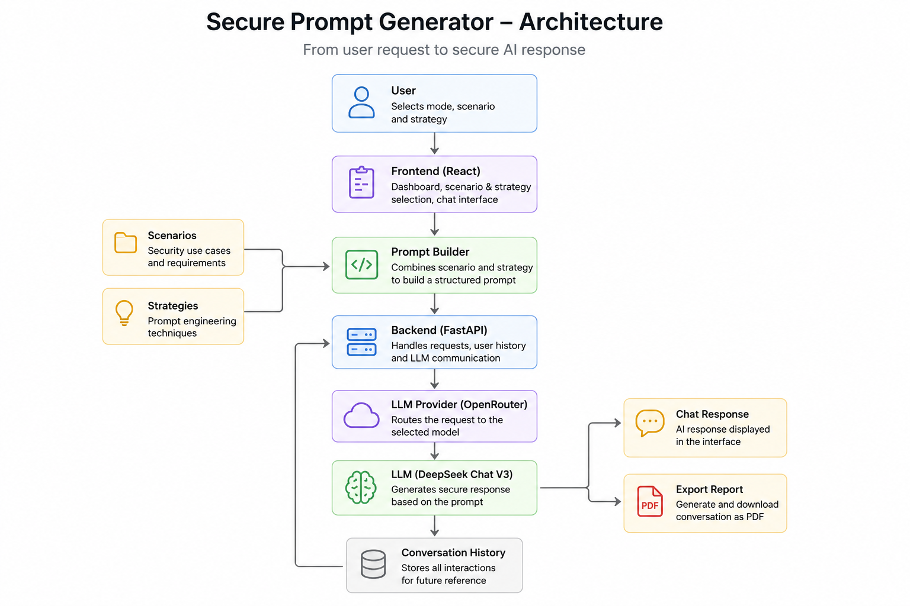

<p align="center">
  
</p>

<h1 align="center">🔐 Secure Prompt Generator</h1>

<p align="center">
  <strong>
    AI-assisted prompt engineering platform for secure code generation
    and vulnerability analysis
  </strong>
</p>

<p align="center">
  <a href="https://secure-prompt-generator-phi.vercel.app">
    
  </a>

  <a href="https://youtu.be/xNK-Ih4BpVI">
    
  </a>

  

  

  

  

  
</p>

---

## 📖 Overview

**Secure Prompt Generator** is a web application designed to improve the
security of interactions with Large Language Models.

Instead of manually creating complex security prompts, users select a
predefined cybersecurity scenario and a prompt-engineering strategy.

The application combines these two elements into a structured prompt and sends
it to the selected LLM through OpenRouter.

The platform supports two primary workflows:

- secure code generation;
- source-code vulnerability verification.

This project was developed during a cybersecurity internship at the
**Université du Québec en Outaouais (UQO)**.

---

## 🚀 Live Application

### Frontend

[https://secure-prompt-generator-phi.vercel.app](https://secure-prompt-generator-phi.vercel.app)

### Backend API

[https://secure-prompt-generator-api.onrender.com](https://secure-prompt-generator-api.onrender.com)

> The backend is hosted on Render's free plan. After a period of inactivity,
> the first request may take several seconds while the service restarts.

---

## 🎥 Application Demonstration

<p align="center">
  <a href="https://youtu.be/xNK-Ih4BpVI">
    
  </a>
</p>

<p align="center">
  <strong>
    <a href="https://youtu.be/xNK-Ih4BpVI">
      ▶ Watch the complete demonstration on YouTube
    </a>
  </strong>
</p>

The demonstration presents:

- scenario and strategy selection;
- secure code generation;
- vulnerability analysis;
- multi-step prompt strategies;
- chat continuation;
- conversation history;
- security checklist generation;
- PDF report export;
- switching between generation and verification modes.

---

## ✨ Main Features

### Secure Code Generation

The generation mode helps users produce secure code based on predefined
security scenarios and prompt-engineering strategies.

Example scenarios include:

- secure authentication;
- JWT authentication;
- secure REST APIs;
- SQL query protection;
- secure file upload;
- password storage;
- CSRF protection;
- XSS protection;
- forgot-password workflows.

### Vulnerability Verification

The verification mode analyzes existing source code and produces a structured
security assessment.

The analysis may include:

- vulnerability identification;
- severity classification;
- OWASP category mapping;
- vulnerable-code explanation;
- potential impact;
- secure corrected code;
- remediation recommendations;
- final security score;
- security checklist.

### Scenario Management

Users can:

- select an existing scenario;
- upload a scenario file;
- create a new scenario;
- edit a scenario;
- delete a scenario.

### Strategy Management

Users can:

- select an existing strategy;
- upload a strategy file;
- create a new strategy;
- edit a strategy;
- delete a strategy.

---

## 💬 Chat with the LLM

The application includes an interactive chat interface that allows the user to
continue the conversation after the initial prompt has been sent to the LLM.

The initial configuration bubble is created only after both a scenario and a
strategy have been selected.

The chat interface supports:

- sending follow-up questions;
- continuing a previous discussion;
- reopening a saved conversation;
- preserving previous user and assistant messages;
- displaying formatted Markdown responses;
- displaying formatted source-code blocks;
- copying LLM responses;
- exporting the conversation as a PDF report;
- preserving the selected scenario and strategy;
- protecting an active conversation before changing context;
- keeping generation and verification conversations separate.

After the first LLM response, the conversation becomes protected. If the user
tries to change the scenario or strategy, the application displays a
confirmation dialog before saving the current discussion and creating a new
chat.

<p align="center">
  
</p>

---

## 🕘 Conversation History

Conversations can be saved and restored from the application history.

The history system supports:

- automatic conversation saving;
- conversation updates;
- reopening previous conversations;
- continuing a saved conversation;
- deleting saved conversations;
- highlighting the active conversation;
- filtering conversations by application mode;
- separate history for generation and verification;
- restoring the selected model;
- restoring the selected scenario;
- restoring the selected strategy;
- restoring all previous chat messages.

<p align="center">
  
</p>

---

## 📄 PDF Security Reports

Verification results can be exported as structured PDF reports.

The generated report may contain:

- a cover page;
- report information;
- selected scenario;
- selected strategy;
- selected LLM model;
- report generation date;
- security score;
- risk classification;
- executive vulnerability summary;
- analyzed source code;
- complete LLM audit response;
- corrected secure code;
- remediation recommendations;
- page numbers.

<p align="center">
  
</p>

---

## 🛡 Security Checklist

After an LLM response, the application analyzes the content and extracts
security controls that appear in the generated solution.

Examples of detected controls include:

- input validation;
- password hashing;
- SQL parameterization;
- JWT expiration;
- rate limiting;
- HTTPS;
- CSRF protection;
- secure cookies;
- least privilege;
- logging;
- multi-factor authentication.

Each checklist is attached directly to the corresponding assistant response.

---

## 🧠 Prompt Engineering Strategies

Secure Prompt Generator implements several prompt-engineering approaches.

| Strategy | Purpose |
|---|---|
| Role Prompting | Assigns a cybersecurity expert role to the LLM |
| One-Shot Prompting | Provides an example before requesting a result |
| Defense in Depth | Applies several layers of security controls |
| Least Privilege | Restricts permissions to the minimum required |
| Threat Modeling | Identifies threats before implementation |
| Security Requirements | Adds explicit security constraints |
| Security Criteria Prompting | Evaluates output against predefined criteria |
| OWASP Compliance | Encourages alignment with OWASP recommendations |
| Self Verification | Requests a review of the generated result |
| Secure Refactoring | Improves insecure or outdated code |
| Vulnerability Analysis | Detects and explains security weaknesses |
| Attack Simulation | Reviews code from an attacker's perspective |
| Security Scoring | Produces a structured security score |
| Patch Generation | Generates corrections for identified weaknesses |
| Microsoft Method | Performs a multi-step security review |

---

## 🔄 Microsoft Method

The **Microsoft Method** is implemented as a multi-step prompt chain.

The scenario already explains what the program is expected to do, so the
strategy focuses on the following stages.

### Step 1 — What Could Go Wrong?

The LLM identifies:

- possible failures;
- vulnerabilities;
- severity levels;
- security impacts;
- related OWASP categories.

### Step 2 — How Can It Be Prevented?

The LLM determines:

- preventive security controls;
- recommended implementation techniques;
- expected secure behavior;
- verification criteria.

### Step 3 — Was It Implemented?

The LLM verifies whether each required control is present in the corrected
solution.

Possible statuses include:

- Implemented;
- Partially Implemented;
- Not Implemented.

### Step 4 — Final Assessment

The final response includes:

- identified risks;
- preventive controls;
- implementation evidence;
- missing controls;
- required corrections;
- compliance percentage;
- final security score;
- final verdict.

This strategy uses several successive LLM calls instead of relying on a single
prompt.

---

## 🖥 Screenshots

### Main Dashboard

<p align="center">
  
</p>

### Scenario and Strategy Selection

<p align="center">
  
</p>

### Secure Code Generation

<p align="center">
  
</p>

### Vulnerability Verification

<p align="center">
  
</p>

### Chat Interface

<p align="center">
  
</p>

### Conversation History

<p align="center">
  
</p>

### PDF Security Report

<p align="center">
  
</p>

---

## 🏗 Architecture

<p align="center">
  
</p>

### Request Flow

```text
User
  │
  ▼
React Frontend
  │
  ├── Scenario selection
  ├── Strategy selection
  ├── Chat interface
  └── Conversation history
  │
  ▼
Prompt Builder
  │
  ├── Security scenario
  └── Prompt-engineering strategy
  │
  ▼
Strategy Engine
  │
  ├── Single-step strategy
  └── Multi-step prompt chain
  │
  ▼
FastAPI Backend
  │
  ▼
OpenRouter API
  │
  ▼
DeepSeek Chat V3
  │
  ▼
LLM Response
  │
  ├── Chat display
  ├── Security checklist
  ├── Conversation storage
  └── PDF report export
```

---

## ⚙️ Technology Stack

### Frontend

- React
- Vite
- JavaScript
- Tailwind CSS
- React Router
- jsPDF
- Markdown rendering
- Fetch API

### Backend

- Python
- FastAPI
- Uvicorn
- SQLAlchemy
- SQLite
- Requests
- Python Multipart
- Python Dotenv

### Artificial Intelligence

- OpenRouter API
- DeepSeek Chat V3
- prompt engineering;
- prompt chaining;
- multi-step strategy execution.

### Deployment

- Vercel — frontend;
- Render — backend;
- GitHub — source-code hosting;
- YouTube — project demonstration.

---

## 📂 Project Structure

```text
Secure_Prompt_Generator/
│
├── backend/
│   ├── Scenarios/
│   │   ├── generation/
│   │   └── verification/
│   │
│   ├── strategies/
│   │   ├── generation/
│   │   └── verification/
│   │
│   ├── main.py
│   ├── database.py
│   ├── scenario_loader.py
│   ├── strategy_loader.py
│   ├── requirements.txt
│   └── conversations.db
│
├── frontend/
│   ├── src/
│   │   ├── components/
│   │   ├── pages/
│   │   ├── strategies/
│   │   │   ├── executors/
│   │   │   └── strategyRegistry.js
│   │   ├── utils/
│   │   ├── App.jsx
│   │   └── main.jsx
│   │
│   ├── package.json
│   └── vite.config.js
│
├── docs/
│   └── images/
│       ├── banner.png
│       ├── architecture.png
│       ├── dashboard.png
│       ├── selection.png
│       ├── generation.png
│       ├── verification.png
│       ├── chat.png
│       ├── history.png
│       └── report.png
│
├── .gitignore
├── LICENSE
└── README.md
```

---

## 🛠 Local Installation

### Prerequisites

Install the following tools before running the project:

- Python 3.10 or later;
- Node.js and npm;
- Git;
- an OpenRouter account;
- an OpenRouter API key.

### Clone the Repository

```bash
git clone https://github.com/Ulrich120/Secure_Prompt_Generator.git
cd Secure_Prompt_Generator
```

---

## Backend Setup

Move to the backend directory:

```bash
cd backend
```

Create a virtual environment:

```bash
python -m venv .venv
```

Activate it on Windows PowerShell:

```powershell
.\.venv\Scripts\Activate.ps1
```

Activate it on Linux or macOS:

```bash
source .venv/bin/activate
```

Install the dependencies:

```bash
pip install -r requirements.txt
```

Create a `.env` file inside `backend/`:

```env
OPENROUTER_API_KEY=your_openrouter_api_key
```

Start the FastAPI server:

```bash
python -m uvicorn main:app --reload
```

The backend will be available at:

```text
http://127.0.0.1:8000
```

Swagger documentation:

```text
http://127.0.0.1:8000/docs
```

---

## Frontend Setup

Open another terminal and move to the frontend directory:

```bash
cd frontend
```

Install the dependencies:

```bash
npm install
```

Create a `.env` file inside `frontend/`:

```env
VITE_API_URL=http://127.0.0.1:8000
```

Start the development server:

```bash
npm run dev
```

The application will be available at:

```text
http://localhost:5173
```

---

## 🔑 Environment Variables

### Backend

| Variable | Description |
|---|---|
| `OPENROUTER_API_KEY` | API key used by the backend to communicate with OpenRouter |

Example:

```env
OPENROUTER_API_KEY=your_openrouter_api_key
```

### Frontend

| Variable | Description |
|---|---|
| `VITE_API_URL` | Public or local URL of the FastAPI backend |

Local example:

```env
VITE_API_URL=http://127.0.0.1:8000
```

Production example:

```env
VITE_API_URL=https://secure-prompt-generator-api.onrender.com
```

---

## 📡 Main API Endpoints

| Method | Endpoint | Description |
|---|---|---|
| `GET` | `/` | Returns the API status |
| `GET` | `/scenarios/{mode}` | Loads scenarios for generation or verification |
| `GET` | `/strategies/{mode}` | Loads strategies for generation or verification |
| `POST` | `/generate` | Sends a generated prompt to the selected LLM |
| `POST` | `/upload-scenario` | Uploads a scenario file |
| `POST` | `/create-scenario` | Creates a scenario |
| `PUT` | `/update-scenario` | Updates a scenario |
| `DELETE` | `/delete-scenario` | Deletes a scenario |
| `POST` | `/upload-strategy` | Uploads a strategy file |
| `POST` | `/create-strategy` | Creates a strategy |
| `PUT` | `/update-strategy` | Updates a strategy |
| `DELETE` | `/delete-strategy` | Deletes a strategy |
| `GET` | `/conversations` | Loads conversations filtered by mode |
| `GET` | `/conversations/{conversation_id}` | Loads one saved conversation |
| `POST` | `/save-conversation` | Saves a conversation |
| `PUT` | `/conversations/{conversation_id}` | Updates a saved conversation |
| `DELETE` | `/conversations/{conversation_id}` | Deletes a conversation |

---

## 🔐 Security Considerations

The application follows several security principles:

- API keys are stored in environment variables;
- the OpenRouter API key is never exposed to the frontend;
- generation and verification scenarios are separated;
- generation and verification strategies are separated;
- conversation history is filtered by application mode;
- security requirements are included in generated prompts;
- vulnerability responses are structured and evidence-based;
- the application avoids requesting hidden internal reasoning from the LLM;
- LLM output is treated as advisory and should still be reviewed by a developer.

---

## 🧪 Testing Checklist

Before deployment, verify the following:

- scenarios load correctly in generation mode;
- strategies load correctly in generation mode;
- scenarios load correctly in verification mode;
- strategies load correctly in verification mode;
- selecting only a scenario does not create the prompt bubble;
- selecting only a strategy does not create the prompt bubble;
- selecting both elements creates the prompt bubble;
- LLM responses are displayed correctly;
- follow-up questions are added to the same chat;
- the Microsoft Method completes all steps;
- security checklists appear under assistant responses;
- conversation history remains separated by mode;
- previous conversations can be reopened;
- active conversations can be continued;
- PDF reports are generated correctly;
- Vercel communicates with the Render backend;
- environment variables are correctly configured.

---

## 🗺 Roadmap

Possible future improvements include:

- user authentication;
- PostgreSQL migration;
- role-based access control;
- multiple LLM providers;
- model-comparison mode;
- prompt-quality metrics;
- automated scenario generation;
- automated strategy generation;
- prompt versioning;
- team workspaces;
- improved mobile responsiveness;
- automated frontend and backend testing;
- Docker deployment;
- CI/CD validation;
- multilingual interface.

---

## 🎓 Academic Context

This project was developed during a supervised cybersecurity internship at the
**Université du Québec en Outaouais**.

The internship focuses on:

- prompt engineering;
- secure use of Large Language Models;
- secure code generation;
- vulnerability detection;
- multi-step prompting strategies;
- LLM response evaluation;
- full-stack web development.

---

## 👨‍💻 Author

**Ulrich Dongmo**

Computer Engineering Student  
Université du Québec en Outaouais  
Cybersecurity Internship — Summer 2026

- GitHub: [github.com/Ulrich120](https://github.com/Ulrich120)
- Repository: [Secure Prompt Generator](https://github.com/Ulrich120/Secure_Prompt_Generator)
- Live application: [secure-prompt-generator-phi.vercel.app](https://secure-prompt-generator-phi.vercel.app)
- Video demonstration: [youtu.be/xNK-Ih4BpVI](https://youtu.be/xNK-Ih4BpVI)

---

## 🙏 Acknowledgements

Special thanks to the internship supervisor for the feedback and guidance
provided throughout the development of the application, particularly regarding:

- scenario and strategy selection behavior;
- multi-step prompting;
- implementation of the Microsoft Method;
- secure prompt design.

---

## 📄 License

This project was developed for academic and research purposes.

Review the `LICENSE` file before reusing, modifying, or distributing the
project.

---

<p align="center">
  Built with React, FastAPI, OpenRouter and DeepSeek Chat V3.
</p>

<p align="center">
  If you find this project useful, consider giving it a ⭐ on GitHub.
</p>